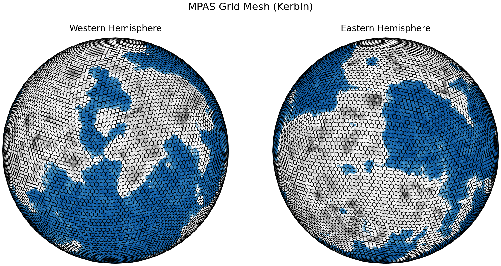

## Kerbal Weather Project 

  

Kerbal Space Program (KSP) is a popular space-flight simulation video game that has been used as a creative sandbox to promote and teach STEM concepts (Manley, 2016). While the game simulates atmospheres with variable depths and densities it lacks dynamic weather limiting its utility as tool for exploring atmospheric science concepts. To remedy this, a groundbreaking weather and climate mod was devloped for KSP. In KWP, weather and climate data from a global circulation model ([MPAS](https://mpas-dev.github.io/)) were incorporated into KSP gameplay through a C# plugin. More information about KWP is available at the [mod webpage](https://kerbalwxproject.space).

### Installation

#### Compatability

KWP works with stock KSP and should work with the vast majority of KSP mods. KWP has been tested, without issue, in a KSP 1.10 playthrough with 220 other popular KSP mods. That said, KWP may conflict with mods like real heat or deadly reentry that modify the stock game's aerodynamic or thermodynamic system. KWP can still be used with these mods as KWP's override of the stock thermodynamic system can be disabled in the settings menu. 

KWP is compatible with the aerodynamics overhaul: Ferram Aerospace Research (FAR). Note that since FAR overrides KSP's thermodynamic system, pressure and temperature data from KWP will not affect flight dynamics when FAR is installed.

#### Background

Kerbin weather and climate analyses were produced using the Model for Prediction Across Scale  (MPAS; Skamarock et al., 2012). 

  

MPAS was run for six-years (1st year: spin-up) at a resolution of 2 x 2 deg. Kerbin is the home world of the game’s main protagonists: the Kerbals! Fortunately, Kerbin’s atmosphere has the same chemical composition as Earth’s

In MPAS, terrain and biome data from KSP were used to classify land use, vegetation type, green fraction, etc.

In addition to land surface modifications, several changes to MPAS were made to enable more realistic simulations of Kerbin's atmosphere. These changes are listed below:
1. Axial obliquity was set to zero.
1. Orbital eccentricity was set to zero.
1. The solar constant was set to 1360 W/m
1. The day length was set to 6 hours (21600 s)
1. The Coriolis parameter was multiplied by 4.

A climatology of Kerbin was developed by averaging the results of the five-year MPAS simulation, by the hour.
Results from this simulation were incorporated into the game via KWP. The hourly climatology allows players to experience diurnal and spatial variations in atmospheric conditions Alternatively, weather time series, extracted at select launch sites, allow players to experience dynamic weather conditions.

#### Settings

  

On the settings page, KWP parameters and defaults can be adjusted. Under weather settings, the default data source can be selected as either climatology or point weather data. The MPAS climatology ensures weather conditions will vary spatially and diurnally. In contrast, point weather data will allow weather to change in time and height, at selected launch sites. Users can select whether KWP will affect KSP's aerodynamic or thermodynamic models under weather settings. This is useful if using other mods that influence these models.

Under wind settings, KWP includes options for the source of wind data. By default, wind data will be provided by MPAS. As an alternative, a constant wind profile can be selected and tweaked to the player's preferred direction and speed. An additional option, for disabling wind within 50-m of the ground, is provided for players who find landing/takeoff in the presence of wind too challenging.

Since KSP is a game enjoyed around the world, KWP incorporates unit settings that allow players to select their preferred units for meteorological parameters. The units default to S.I. units.

#### Acknowledgements

* KSP Developer Squad and KSP creator Felipe Falanghe.
* KSP Modding Community – specifically KSP forum users linuxgurugamer, JoePatrick1, Fengist, DaMichel, NathanKell, and DMagic. These mod developers in particular, by pubishing their code publicly, provided a valuable teaching tool which facillitated many of the advancements implemented in KWP. Without their prior work, incporating weather data into KSP would have been exceedingly difficult.

#### References
Manley (2016), Can Kerbal Space Program Really Teach Rocket Science? https://www.youtube.com/watch?v=ogC6ds81gek. Accessed 12 December 2020.
Skamarock, W. C., J. B. Klemp, M. G. Duda, L. D. Fowler, S. Park, and T. D. Ringler, 2012: A Multiscale Nonhydrostatic Atmospheric Model Using Centroidal Voronoi Tesselations and C-Grid Staggering. Mon. Wea. Rev., 140, 3090–3105, https://doi.org/10.1175/MWR-D-11-00215.1. 
